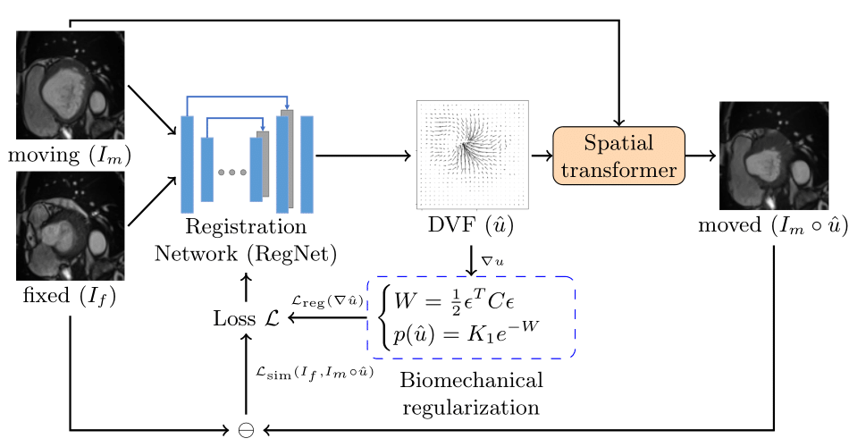

# Learning correspondences of cardiac motion from images using biomechanics-informed modeling
This repository is the official implementation of "Learning correspondences of cardiac motion from images using biomechanics-informed modeling" accepted by MICCAI-STACOM 2022 (oral presentation).

## [[Paper]](https://arxiv.org/abs/2209.00726) [[Video]](https://www.youtube.com/watch?v=-Phnr3VGDuo&ab_channel=XiaoranZhang) [[Poster]](assets/files/STACOM2022_poster_Xiaoran.pdf) [[Slides]](assets/files/STACOM2022_slides_Xiaoran.pdf)

## Framework


## Bibtex
Please consider citing our paper if you find anything helpful from our project :) Thanks very much!
```
@article{zhang2022learning,
  title={Learning correspondences of cardiac motion from images using biomechanics-informed modeling},
  author={Zhang, Xiaoran and You, Chenyu and Ahn, Shawn and Zhuang, Juntang and Staib, Lawrence and Duncan, James},
  journal={arXiv preprint arXiv:2209.00726},
  year={2022}
}
```

## Dataset
We validated our methods on two public datasets: 1) ACDC 2017 [[link]](https://www.creatis.insa-lyon.fr/Challenge/acdc/databasesTraining.html) 2) LV quantification 2019 dataset [[link]](https://github.com/TiancongHua/Left-Ventricle-Full-Quantification-Challenge-MICCAI-2019). Please check our paper for details.

## Environment
We validate our methods on Pytorch=1.9.1, cuda=10.2, cudnn=7.6.5. Please refer to $\texttt{environment}.yml$ for more details. To replicate, please use
```
conda env create -f environment.yml
```

## Default directory structure
    ├── Dataset                   
    |   ├── ACDC2017       # Place the downloaded dataset here
    |   |   ├── training
    |   |   ├── testing
    |   |   ├── validation
    |   ├── LV_Quant_Challenge
    |   |   ├── Original_data
    |   |   |   ├── TrainingData_LVQuan19 # Place the downloaded dataset here
    |   |   ├── training
    |   |   ├── ...
    ├── Code
    |   ├── bioinformed_reg
    |   |   ├── train.py
    |   |   ├── test.py
    |   |   ├── ...
   
## Setup
### Dataset preprocessing
ACDC 2017 dataset requires no preprocessing in our setup. For LV quantification 2019, please run
```
python LV_Quant_preprocess.py
```

### Train RegNet+BIM
```
python train.py --losstype bmreg --dataset [YOUR_CHOICE] --lmbd [YOUR_CHOICE] --nup [YOUR_CHOICE]
```
### Train RegNet+BIM+$\mathcal{L}_{seg}$
```
python train.py --losstype bmreg_seg --dataset [YOUR_CHOICE] --lmbd [YOUR_CHOICE] --nup [YOUR_CHOICE] --gamma [YOUR_CHOICE]
```
### Test
```
python test.py --model_name [YOUR_CHOICE]
```
### Train/test other models
Simply change the $\texttt{losstype}$ prompt for other regularization terms. For b-spline or optical flow, run following
```
from registration import func_runRegistration

model_name = 'model_ACDC17_bmreg_nup_0.4_bs_4_epoch_100_lr_0.0001_lmbd_0.05' # any model name as the purpose is only to load the dataset
func_runRegistration(model_name, 'ACDC17', 'bspline') # simply change 'bspline' to 'optflow'
```


## Trained model weights
We provide four trained weights organized as follows for our proposed methods:

    ├── Models                   
    |   ├── model_ACDC17_bmreg_nup_0.4_bs_4_epoch_100_lr_0.0001_lmbd_0.05.pth                      # RegNet+BIM for ACDC
    |   ├── model_ACDC17_bmreg_seg_nup_0.4_bs_4_epoch_100_lr_0.0001_lmbd_0.05_gamma_0.01.pth       # RegNet+BIM+Lseg for ACDC
    |   ├── model_LVQuant19_bmreg_nup_0.4_bs_4_epoch_100_lr_0.0001_lmbd_0.001.pth                  # RegNet+BIM for LV quantification
    |   ├── model_LVQuant19_bmreg_seg_nup_0.4_bs_4_epoch_100_lr_0.0001_lmbd_0.001_gamma_0.01.pth   # RegNet+BIM+Lseg for LV quantification


## Examples & Reproducibility
Please refer to our $\texttt{demo.ipynb}$ for examples and reproducibility.


## Acknowledgement
We refer the RegNet & bioinformed-vae implementation to [[link]](https://github.com/cq615/Biomechanics-informed-motion-tracking). Please cite their paper as well if you use it.